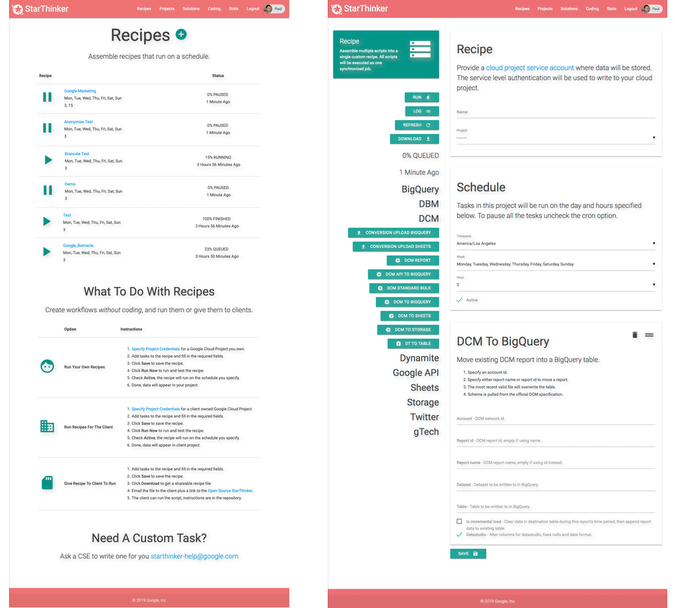

This is not an officially supported Google product.  It is a reference implementation.
There is absolutley NO WARRANTY provided for using this code.

# gTech StarThinker Workflow Framework For Externalizing Solutions

StarThinker is a Google gTech built python framework for creating and sharing re-usable workflow components on
Google Cloud infrastructure. To make it easier for partners and clients to work with some of our advertsing 
solutions, the gTech team has open sourced this framework as a reference implementation.  Our goal is to make 
managing data workflows using Google Cloud as fast and re-usable as possible, allowing teams to focus on 
building advertising solutions.

## Why Use The StarThinker Open Source Code?

- Develop custom client solutions in days not months.
- Deploy suite of solutions without coding for clients in minutes not weeks.
- The framework provides practical working examples of moving data using Google Cloud.
- Google teams can hand over internally built solutions to your team on top of this framework.
- The code has been stress tested internally across projects and includes many best practices.
- The code runs at scale, allowing you to simply upgrade Cloud Machines to move larger data sets.
- There is an easily deployable UI that can be stood up within minutes on Google Cloud.
- **The code is Apache Licensed and fully modifiable by your team.**

## Where Is The Documentation?

Most directories contain a README.me file. These are instructions for how to use the code in that directory.
For getting started with and [tutorials/README.md](deploying StarThinker solutions see the tutorials).
General structure of the code is:

- [/install](install/) - Scripts for installing and deploying StarThinker.
- [/tutorials](tutorials/) - Tutorials for using StarThinker code base.
- [/starthinker/util](starthinker/util/) - Low level library wrappers around Google API with helpers to handle common errors.
- [/starthinker/task](starthinker/task/) - Handlers for each task specified in a JSON recipe.
- [/starthinker/gtech](starthinker/gtech/) - Complete solution templates provided by Google gTech that you can deploy.
- [/starthinker/script](starthinker/script/) - Command line for converting a recipe template into a client specific executable recipe.
- [/starthinker/all](starthinker/all/) - Developer command line for executing a recipe in its entirety.
- [/starthinker/cron](starthinker/cron/) - Quick command line for executing recipes on a schedule.
- [/starthinker/auth](starthinker/auth/) - Developer command line for testing user credential setup.
- [/starthinker_ui](starthinker_ui/) - UI code deployed on AppEngine powered by Django.
- [/starthinker_assets](starthinker_assets/) - Holds all configuration files when you launch StarThinker.
- [/starthinker_airflow](starthinker_airflow/) - Deploys recipes as AirFlow DAGs, optional.
- starthinker_virtualenv/ - After deploy, holds virtual environment libraries on setup.
- starthinker_database/ - After deploy, holds local development database on setup.
- starthinker_cron/ - After deploy, holds recipes executing using local cron on setup.

## What are some common terms?

StarThinker uses JSON configuration blocks that map to python run handlers.  When these JSON blocks
are assembled in sequence, a recipe is created that can execute complex workflows.  To make the JSON
configurations re-usable they are packaged as templates that can be populated with client specific
data on the command line or the UI.

- **recipe script / solution** - a JSON file with a structure script\*.json and { 'field':{...}} placeholders.
- **recipe** - a JSON file with all the { 'field':{...}} placeholders replaced with actual values.
- **task** - any run.py script, its directory will map to a task JSON block in a recipe.

# Deploy StarThinker

StarThinker can be deployed four different ways depending on the organization requirements. For specific 
instructions for each type of setup, read the [Tutorials](tutorials/README.md) or specific instructions:

- [Enterprise](tutorials/deploy_enterprise.md) - Full browser based UI with multiple user login.
- [Scientist](tutorials/deploy_scientist.md) - Single user, fast setup, long running job scheduler.
- [Developer](tutorials/deploy_developer.md) - Command line recipe creation, editing, and testing.
- [Package](tutorials/deploy_package.md) - Workshop import and run instantly.

To make deployment easy and well documented, StarThinker is packaged with a deploy script to automate
the process.  The script uses bash commands just like a user would from the command line, making it a
"how to document" as well. 

## SarThinker Enterprise Solution Gallery

A [Solution Gallery](https://google.github.io/starthinker/) is built into StarThinker.  The Google gTech 
team has built and included several solutions within StarThinker. These solutions deminstrate the level 
and quality of what can be built using Google Cloud in a rapid development framework like StarThinker. The 
solution gallery is automatically generated from StarThinker recipe files, it is fully customizable
and extensible by your organization.

## Where Do I Get Help?

Read the [Tutorials](tutorials/README.md) to get a sense of how starthinker works. There is also the [FAQ](tutorials/faq.md).

Or Email: starthinker-help@google.com

## Authors 

- Paul Kenjora ( kenjora@google.com ) - Google gTech
- Mauricio Desiderio ( mauriciod@google.com ) - Google gTech
- John Terwilleger ( terwilleger@google.com ) - Google gTech

Additional contributors to individual handlers and recipes are listed in each file.

---
&copy; 2019 Google Inc. - Apache License, Version 2.0
