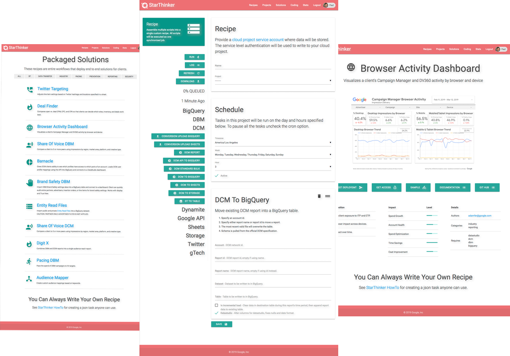

This is not an officially supported Google product.  It is a reference implementation.
There is absolutely NO WARRANTY provided for using this code.  **The code is Apache Licensed
and CAN BE fully modified, white labeled, and disassembled by your team.**

# Scaled Automation Application For Ad Operations Teams

At gTech, we believe every ad operations team should be faster, nimbler, and able to use all their data sources
to drive client impact.  To that end, we've created StarThinker, a simple and intuitive web UI that allows users
to create, edit, run, and schedule data pipelines consisting of data transfer and data processing jobs.
StarThinker deploys on Google Cloud in minutes without engineering or coding required.  [Read the WhitePaper](tutorials/images/StarThinker_Whitepaper.pdf).

## For Ad Operations Teams...

Sheets only go so far, with a StarThinker running, the ad operations team can operate on larger data sets, scale
solutions across clients fast, and even automate campaign controls.  All using a drag and drop UI.

- Start building solutions immediately by leveraging [dozens of existing workflow tasks](https://google.github.io/starthinker/).
- Scale solutions across clients [without coding](https://google.github.io/starthinker/help/#help_recipe).
- Pull repository [updates anytime](tutorials/deploy_enterprise.md).
- Empower your team with simple [UI documentation](https://google.github.io/starthinker/help/).
- Bill [clients for data usage](https://google.github.io/starthinker/help/#help_setup).
- Monitor all workflows from [one UI](https://google.github.io/starthinker/help/#help_status).
- Build enteprise solutions in hours not weeks.

Steps From [Tutorial](tutorials/README.md):
- [ ] [Deploy UI on GCP.](tutorials/deploy_enterprise.md)
- [ ] [Configure a GCP Project for client data warehousing.](https://google.github.io/starthinker/help/#help_setup)
- [ ] [Run a recipe workflow.](https://google.github.io/starthinker/help/#help_recipe)

## For Ad Engineering Teams....

No one enjoys building boiler plate code, its slow, error prone, tedious, and honestly drains the energy out of
any project. At best StarThinker lets you skip all that, at worst it's working code you can strip down for your needs.
Take what you need.

- Out of the box [authentication](tutorials/deploy_enterprise.md).
- Out of the box [scaling](tutorials/architecture.md).
- Out of the box [logging](tutorials/logging.md).
- Out of the box [testing](tutorials/testing.md).
- All Apache Licensed to give you a head start and complete development control.

Steps From [Tutorial](tutorials/README.md):
- [ ] [Deploy developer.](tutorials/deploy_developer.md)
- [ ] [Run hello world.](tutorials/running.md)
- [ ] [Develop a new task or recipe workflow.](tutorials/README.md#development)
- [ ] [Optional: Get your own private copy of the code.](CONTRIBUTING.md)
- [ ] [Optional: Make contributions to an open source Google project.](CONTRIBUTING.md)

## Where Do I Get Help?

- The [StarThinker Solution Gallery](https://google.github.io/starthinker/) lists all the existing tasks and authors.
- Read the [Tutorials](tutorials/README.md).
- Review the [FAQ](tutorials/faq.md).
- Read the [Contributing Process](CONTRIBUTING.md).
- Ask for help ( no SLA, not guaranteed ): starthinker-help@google.com

## Authors

- Paul Kenjora ( kenjora@google.com ) - Technical Project Lead
- Mauricio Desiderio ( mauriciod@google.com ) - Software Engineer
- John Terwilleger ( terwilleger@google.com ) - Software Engineer

Additional contributors to individual handlers and recipes are listed in each file.

---
&copy; 2020 Google LLC - Apache License, Version 2.0
