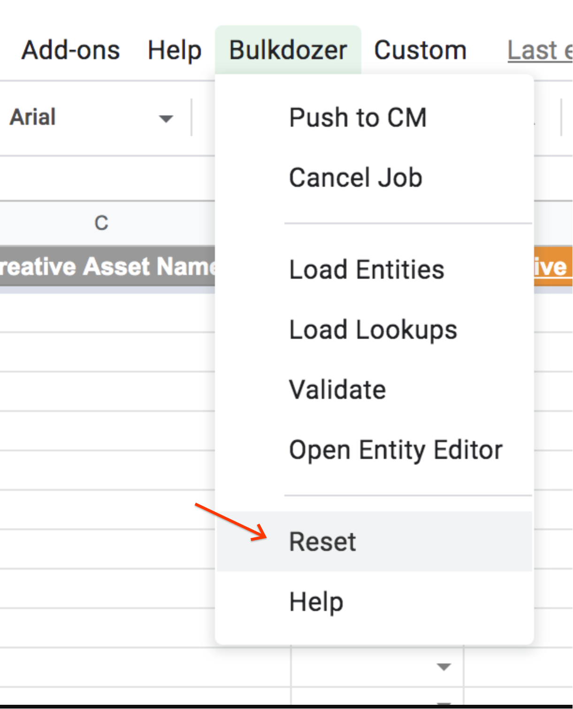

# Bulk Creative Swaps

## Introduction

Swapping creatives is a very common use case in live campaigns,
some examples include when a creative is underperforming, when a specific
promotion has ended, when prices change, etc.

Swapping creatives manually in Campaign Manager can be very time consuming
and error prone. Bulkdozer can give you the confidence of quickly and
easily updating all creatives in bulk with a single operation.

## Before you Begin

You will need a Bulkdozer feed, if you don't have one please refer to
the Feed Setup page. You will also need an existing campaign to
validate. We suggest that you do not use Bulkdozer to modify live
campaigns before you have familiarized yourself with the tool, so either
use an old campaign that is no longer live, or create your own. If you
want to create a test campaign with Bulkdozer you can do so by following
the Getting Started guide.

You will also need another creative to swap to. You can select an
existing creative of the same type on your advertiser, or you can upload
 a new one directly to Campaign Manager. For this example we will use a
 video creative, you can do the same process with display creatives by
 using the appropriate type under the placement and creative. Make note
 of the creative ID that you would like to swap to.

## Reset your feed

Since we are going to start working on a new campaign, it is always a
good idea to reset your feed. You can do that through the menu Bulkdozer
-> Reset. Resetting may take up to a minute, wait for the "Running
script" message to disappear before moving to the next step.

## Load your Campaign

For details on how to load an existing campaign into the Bulkdozer feed
refer to the [Changing Existing Campaigns guide](Changing_Existing_Campaigns.md).

## Associate the new creative with the campaign

If the creative you want to swap to is already associated with the
campaign you are working with you can skip this step, otherwise go to
the Creative tab and enter a new row:

- Advertiser ID: The advertiser id of the campaign and creative.
- Campaign ID: Select your campaign in the drop down.
- Creative ID: The id of the creative you want to swap to.
- Creative Name: The name of the creative you want to swap to.
- Creative Type: VIDEO

## Swap the creatives

Go to the Ad Creative Assignment tab, and update the Creative ID
column to be the id of the creative you want to swap to for all ads you
want to use the new creative.

## Push to Campaign Manager

Push to Campaign Manager by going to your StarThinker recipe and clicking the
"Run" button.

Watch the Log tab as the process runs and your campaign is trafficked.
When you see the message "Bulkdozer traffic job ended" in the logs the
process is done.

If you see any errors in the Log tab you can make corrections to the
appropriate tab and push again.

Once the process finishes successfully, open the campaign in Campaign
Manager to see the new creative associated with all ads you've identified.

  
---
&copy; 2019 Google Inc. - Apache License, Version 2.0

By using Bulkdozer the user agrees with the
[Terms & Conditions](Terms_and_Conditions.md).
