# Simple Campaign Trafficking - create a campaign from scratch

## Introduction

This guide will show you how to Use Bulkdozer to create a simple
campaign consisting of:

-  creative asset
-  landing page
-  campaign
-  creative
-  placement
-  ad

## Before you Begin

Bulkdozer uses a Feed Color Coding system. The title of the columns in
the Bulkdozer feed are color coded to indicate the behavior of each field,
here is what color means:

- Orange: User provide, used on insert only, not updateable after
initial load
- Black: IDs. User provided in the “ext…” format for initial load or
actual IDs for existing items for mapping purposes. After first run ext
IDs will be updated with the actual DCM IDs.
- Gray: Populated automatically by Bulkdozer for informational purposes,
for instance so you know the campaign name with which a placement is tied,
not used for insert or update.
- Green: Updateable fields, used for inserting new items, and can be
updated in subsequent executions.

## Populate the required tabs with the necessary information.

**Please note, black columns require an “ext” in front so that the cells
will populate with the newly created Campaign Manager (CM) IDs once the
sheet is pushed to CM.**
Tabs needed are filled out with example information below. They include:

- Creative Asset

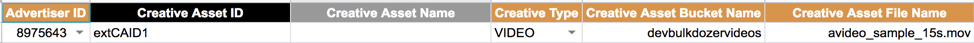

- Landing Page

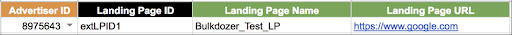

- Campaign

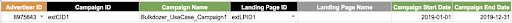

- Creative

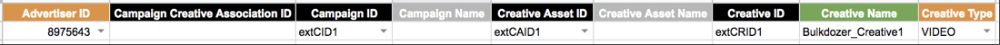

- Placement

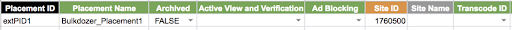

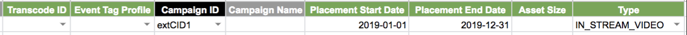

- Ad

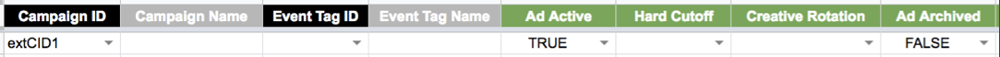

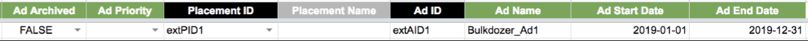

- Ad Creative Assignment

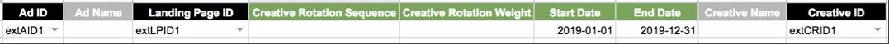

The grey columns below will populate automatically once you push to CM.

## Push to Campaign Manager

Push to Campaign Manager by going to your StarThinker recipe and clicking the
"Run" button.

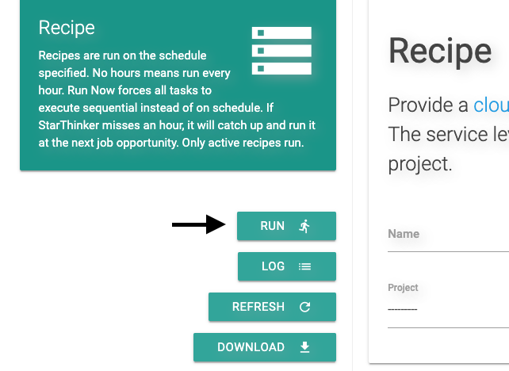

Watch the Log tab as the process runs and your campaign is trafficked.
When you see the message "Bulkdozer traffic job ended" in the logs the
process is done.

If you see any errors in the Log tab you can make corrections to the
appropriate tab and push again.

Once the process completes successfully, go to your campaign in Campaign
manager and verify the event tags applied to the ads under the placement
you've configured with the profile.

## Sanity check:

After completing the above steps you will have a customized Google sheet
representing the “Feed” and have a Bulkdozer instance deployed. This
section will help you to determine whether all components are accessible
and that the tool has been successfully deployed.

Open your copy of the “Feed”. At this stage we will check connectivity
with CM and perform the authentication process.

## Expected Result

- Campaign created as defined with no errors.
- Associations are correct:
- Site under Campaign
- Placement under Site;
- Ad under placement
- Creative associated with ad;
- Log tab displays “Bulkdozer traffic job ended” and calls out no errors
- How your campaign should look in Campaign Manager:

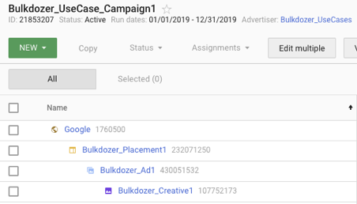

  
---
&copy; 2019 Google Inc. - Apache License, Version 2.0

By using Bulkdozer the user agrees with the [Terms & Conditions](Terms_and_Conditions.md).
