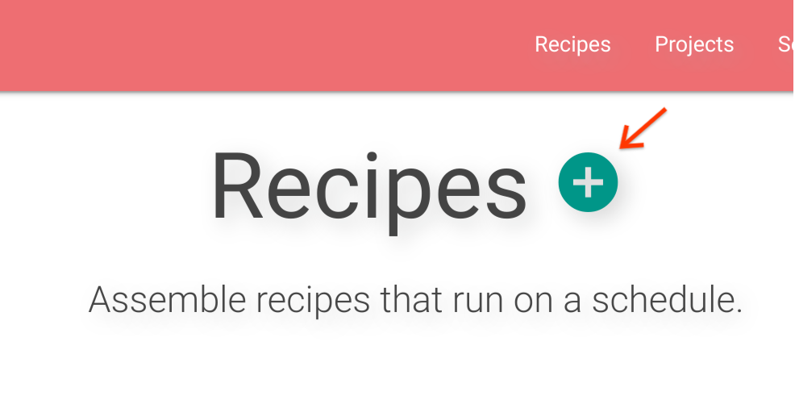
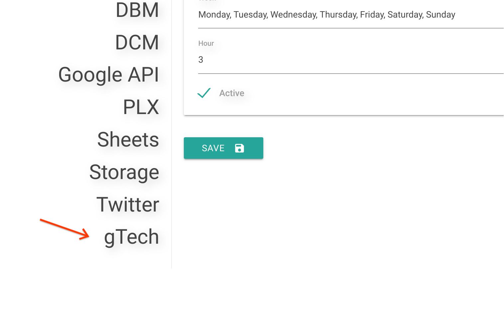
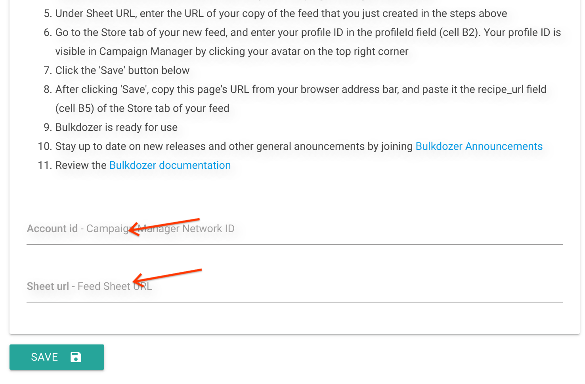
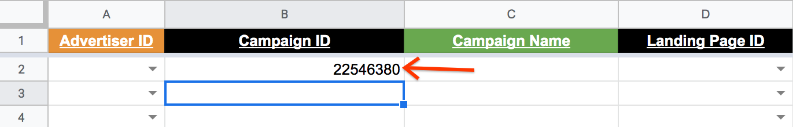
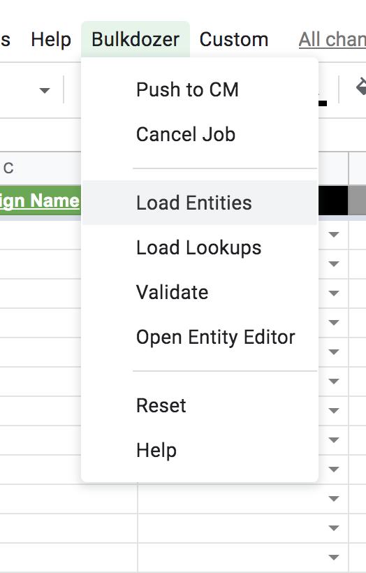
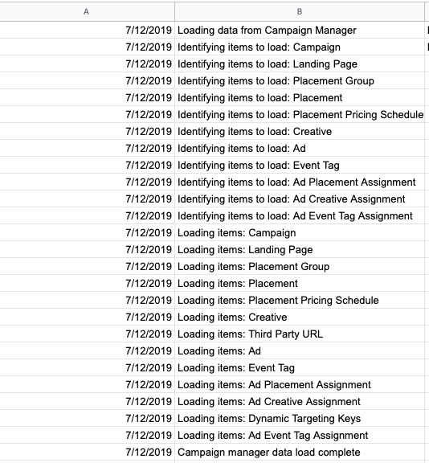

# Bulkdozer

- [Product Overview](#product_overview)  
- [How-to Guides](#documentation)  
- [Quickstart](#quickstart)  
- [Terms and Conditions](#terms_and_conditions)  
- [Support](#support)  

## Product Overview

Bulkdozer helps drive Marketer, Agency and Partner Ad Ops trafficking
efficiency by automating bulk actions normally made within Campaign
Manager (CM). It provides a customized Google Sheet to load and visualize
 CM data and allows the user to make changes to placements, ads, landing
 pages, etc. with speed and efficiency.

Fewer manual steps lead to fewer errors increasing campaign quality and
the visualization that Bulkdozer provides is valuable to validate and
audit campaigns. Furthermore, Bulkdozer's users can respond faster to
insights from dashboards and other tracking platforms they own.

This is an open source tool that should be deployed directly to Google
Cloud platform projects.

[Back to top](#top_page)

## How-to Guides

> [Changing Existing Campaigns](Changing_Existing_Campaigns.md)
>
>[Campaign QA and Verification](Campaign_QA_and_Verification.md)
>
>[Applying Event Tags at the Site Level](Applying_Event_Tags_Placement_Level.md)
>
>[Bulk Creative Swaps](Bulk_Creative_Swaps.md)
>
>[Simple Campaign Trafficking - create a campaign from scratch](Create_simple_campaign_from_scratch.md)
>
>[Back to top](#top_page)  

## Quickstart

In this quickstart, you will use the StarThinker platform to create a
new recipe, by doing so, you will deploy both the UI and Backend
components of Bulkdozer.

Bulkdozer has a server component that pushes changes to Campaign Manager
and a customized Google Sheet, called a “Feed”, that serves as a bulk
editing UI. The server side component can serve multiple users in the
same Campaign Manager network. The “Feed” is typically personal, and each
user should have their own copy.

This quickstart walks you through creating a basic configuration file
and using that file to create a deployment. To complete this tutorial,
you must have proficient knowledge of the Campaign Manager.

[Back to top](#top_page)

### Before you begin

Please make sure you have the StarThinker platform up and running on your
Google Cloud Platform (GCP) and have either the [Enterprise](https://github.com/google/starthinker/blob/master/tutorials/deploy_enterprise.md)
or the [Scientist](https://github.com/google/starthinker/blob/master/tutorials/deploy_scientist.md)
version deployed to enable Bulkdozer to fully work.

#### Add a new recipe to the StarThinker platform:
1. Navigate to [https://bulkdozer-starthinker.appspot.com](https://bulkdozer-starthinker.appspot.com ) and login
using your Google account.

>In case the StarThinker platform is hosted under a different local
domain, browse to the equivalent relative path.

2. Click on the *‘plus’* sign button to the right of the *'Recipes'* title.

3. Authorize the application (it is possible that a screen will show
saying the application isn't verified, click advanced and proceed).

>After authenticating you may need to click the *‘plus’* sign button again.

4. On the Recipe page scroll down and choose the *'gTech'* category from
the menu on the left. Once the menu has expanded click the *‘Bulkdozer’* button.

 

5. At this stage the page displays three sections **Recipe, Schedule,**
and **Bulkdozer**. Fill in the following details:

   **Recipe section:**  
    <u>Name field</u> - Enter a recipe name. We suggest you use the name
    of the CM account for which you are setting up Bulkdozer.  
    <u>Project field</u> - Use empty default value

     

   **Schedule section** 
    <u>Timezone field</u> - Apply a timezone to “Feed” content. In case
    of time zone differences with CM (EST time zone), the dates in the
    “Feed” will convert and run as expected in your time zone. 
    <u>Week field</u> - This field is for schedule a job and is not
    applicable for Bulkdozer in this version. **Use empty default value.** 
    <u>Hour field</u> - This field is for schedule a job and is not
    applicable for Bulkdozer in this version. **Use empty default value.** 

   

    **Bulkdozer section:** By following the steps in this section of the
    webpage, you will create the “Feed” for the current Bulkdozer instance
    that we are deploying. Once the steps are complete, you will have
    the information needed to fill the form.

    <u>Account id field</u>- Campaign Manager Network ID  
    <u>Sheet url field</u> - “Feed” Sheet URL

   
6. Save the configuration by clicking the *'Save'* button. These settings
are saved for future use.
**Note**: Making changes to this form will not override existing copy,
but creates a new set of deployment instructions.

7.  To push changes from Bulkdozer's *“Feed”* to Campaign Manager you
will need to run the recipe. Click the *'Run'* button which is located on
top of the recipe page.

## Sanity check:

After completing the above steps you will have a customized Google sheet
representing the “Feed” and have a Bulkdozer instance deployed. This
section will help you to determine whether all components are accessible
and that the tool has been successfully deployed.

Open your copy of the “Feed”. At this stage we will check connectivity
with CM and perform the authentication process.

1. Reset the “Feed”: click on the *‘Bulkdozer’* dropdown menu and choose
the *‘Reset’* option

2. Identify items to load: to load an entire campaign, a campaign ID is
required. Fill in the "Campaign ID" field of the Campaign tab with an
existing campaign id (it is recommended to sanity check an inactive
campaign).

3. Load Entities: click on the *‘Bulkdozer’* dropdown menu and choose
the *‘Load Entities’* option.

Click ‘yes’ in the confirmation popup, and notice how Bulkdozer moves
to the "Log" tab of the feed where you can visualize job progress.
Once you see a message saying: "Campaign Manager data load complete" the
process is done.

[Back to top](#top_page)

## Terms and Conditions

By using Bulkdozer the user agrees with the
[Terms & Conditions](Terms_and_Conditions.md).

[Back to top](#top_page)

## Support

Bulkdozer is community supported, if you have any issues or questions please post a new issue [here](https://github.com/google/starthinker/issues)

Sign up for updates and announcements: [Bulkdozer Announcements](https://groups.google.com/forum/#!forum/bulkdozer-announcements)

[Back to top](#top_page)

  
---
&copy; 2019 Google Inc. - Apache License, Version 2.0

By using Bulkdozer the user agrees with the
[Terms & Conditions](Terms_and_Conditions.md).

