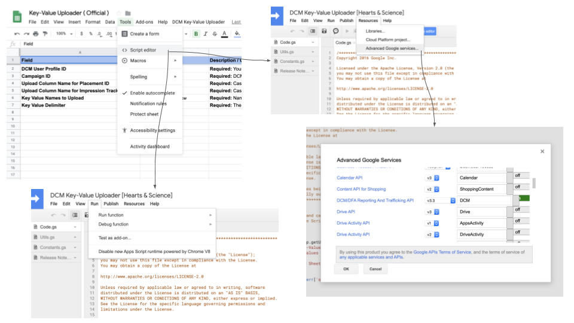

# App Script Troubleshooting

## Common AppScript Settings

---
### Tool controls are not showing in the menu at the top of the sheet?

For older scripts you need to **Disable new App Script runtime powered by Chrome V8**, navigate to
**Script Editor** then from the **Run** menu ensure Chrome V8 runtime is disabled. When you close
the script edit tab and refresh your sheet, the tools menu should appear at the top.

---
### An error indicating the API is not enabled appears?

Google services need to be turned on for each script.  Usually the script has the correct services active
at the time it is built, but sometimes servies may need to be turned on or API versions changed. Navigate
to **Script Editor** then from the **Resources** menu choose **Advanced Google Services**.  From the
dropdown ensure the API and version matches the endpoint you are connecting to.  Changing versions may
break the script and require a development to fix.

---
&copy; 2019 Google Inc. - Apache License, Version 2.0
