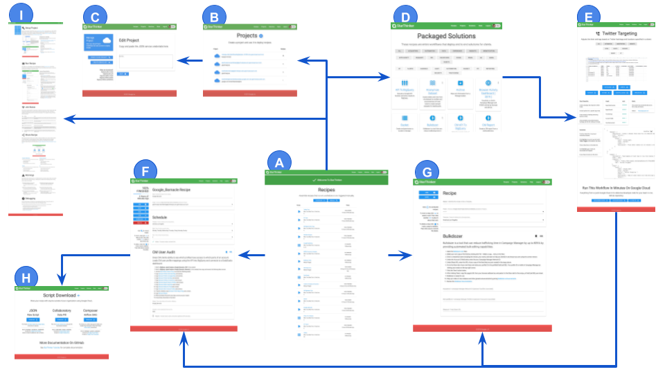
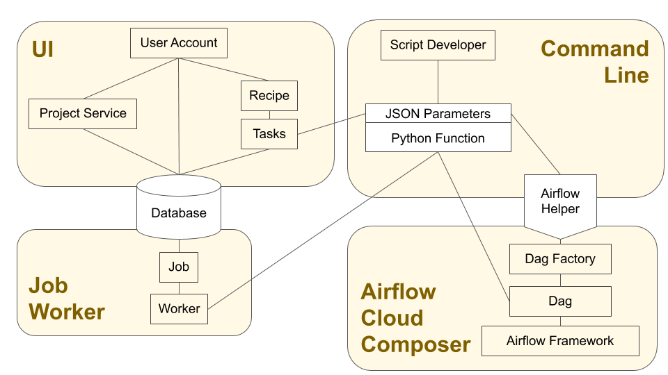

# StarThinker Architecture

## Overview

At the core of StarThinker are python functions with a JSON defined parameter set.  The JSON allows
various interfaces such as UI and command line.  The python functions in their simplicity allow
for deployment on many back ends.  The architecture packaged in this project is fully extensible and
customizable.

This is a typical pattern deployed for large scale job processing.  It is designed to get any team started using
both open source and Google Cloud technologies.  StarThinker can be leveraged as a whole or in pieces, the central
contract is the JSON/Python script task combination.

[View Architecture Larger](images/architecture.png) / [View Application Slides](https://docs.google.com/presentation/d/1Ro3KSV8Y-7xyNtvG0IsRB5E2zBYLnRso8tTOVvyUCv0/edit?usp=sharing)

## Components

### [UI](../starthinker_ui) ( Enterprise Deployment )

Light weight open source [Django Framework](https://www.djangoproject.com/) using open source [Materialize CSS](https://materializecss.com/) for the interface. Manages recipes and authentication using a browser interface.  Ideal for [deploying](deploy_enterprise.md) in a multiuser enterprise programmatic media teams.

   1. [User Account](cloud_client_web.md) - Google oAuth allows recipes to execute with user's permissions.
   1. [Project Service](cloud_service.md) - Google Cloud Project Service Credentials allow recipes to access cloud resources.
   1. [Recipes](https://google.github.io/starthinker/help/) - Assemble scripts into scheduled recipes without coding.
   1. [Tasks](recipe.md) - Each recipe is a collection of tasks, parameters are parsed and stored in a database by the UI.
   1. [Database](cheat_sheet.md#production) - Databse used to store user created recipes for execution by job worker.

---

### [Job Worker](../starthinker_ui/recipe/management/commands/job_worker.py) ( Enterprise Deployment )

Scalable back end for pulling and executing jobs. Multiple machines can be [deployed](deploy_enterprise.md) with several workers each.  Collision detection is built in, each worker will reserve tasks.  If a worker stops working, other workers will begin pulling dropped tasks.  The [deploy](../install/deploy.sh) script offers 4 scale options, that can be extended to any size budget permitting.  The worker has [full test coverage](../starthinker_ui/recipe/tests.py) for safe maintenance.

   1. [Database](cheat_sheet.md#production) - Database polled by worker requesting recipe jobs.
   1. [Job](../starthinker_ui/recipe/models.py) - A task returned to the worker containing all information to run it.
   1. [Worker](../starthinker_ui/recipe/management/commands/job_worker.py) - The code deployable on a virtual machine at scale, to execute each task.

---

### [Command Line](deploy_developer.md) ( Optional Developer Support Interface )

Command line for creating, testing, and executing scripts.

   1. [Script Developer](task.md) - The author of every script needs only to provide a JSON script file and python function that is tested.  This simplifies and speeds up development by seperating it from the UI and workers.
   1. [JSON Parameter](recipe.md) - Definition of parameters for python function, understood by all components of StarThinker.
   1. [Python Function](task.md) - Any python function for any purpose.

---

### [Airflow Cloud Composer](deploy_airflow.md)  ( Optional Alternate Deployment )

Connector for deploying recipes to Apache Airflow.

   1. [Dag Recipes](../dags/) - List of all StarThinker recipes as Airflow DAGs.
   1. [Dag Generator](../starthinker_ui/website/management/commands/airflow.py) - Utility for generating Dags from recipes.
   1. [Dag Factory](../starthinker_airflow/factory.py) - Python function doing the actual translation of JSON into a DAG.
   1. [Dag](https://cloud.google.com/composer/docs/how-to/using/writing-dags) - A wrapper for a python function in Airflow.
   1. [Cloud Composer](https://cloud.google.com/composer/) - Google Cloud instance of Apache Airflow.
   1. [Airflow Framework](https://airflow.apache.org/) - Project documentation and tutorials.

---
&copy; 2019 Google LLC - Apache License, Version 2.0
