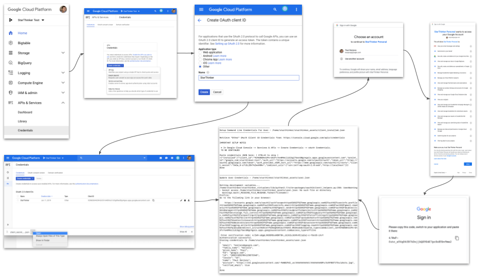

# StarThinker Command Line Client Credentials

## Create Client Credentials ( Desktop )

Retrieve oAuth Client Id from: https://console.cloud.google.com/apis/credentials

[View Cloud Client Other Setup Larger](images/cloud_client_installed.png)

### Setup Steps

 1. Google Cloud Project -> APIs & Services -> Credentials -> Create Credentials -> oAuth Client Id.
   1. Select Desktop.
   1. Name is StarThinker.
 1. Click the download icon next to the new credentials and open the downloaded file.
 1. Copy the contents and paste into the StarThinker deployment script when prompted for Client Installed Credentials.

### Verify

If all goes well, after deployment, the following files should exist with your credentials inside:

- starthinker_assets/client_installed.json
- starthinker_assets/user.json

---
&copy; 2019 Google Inc. - Apache License, Version 2.0
