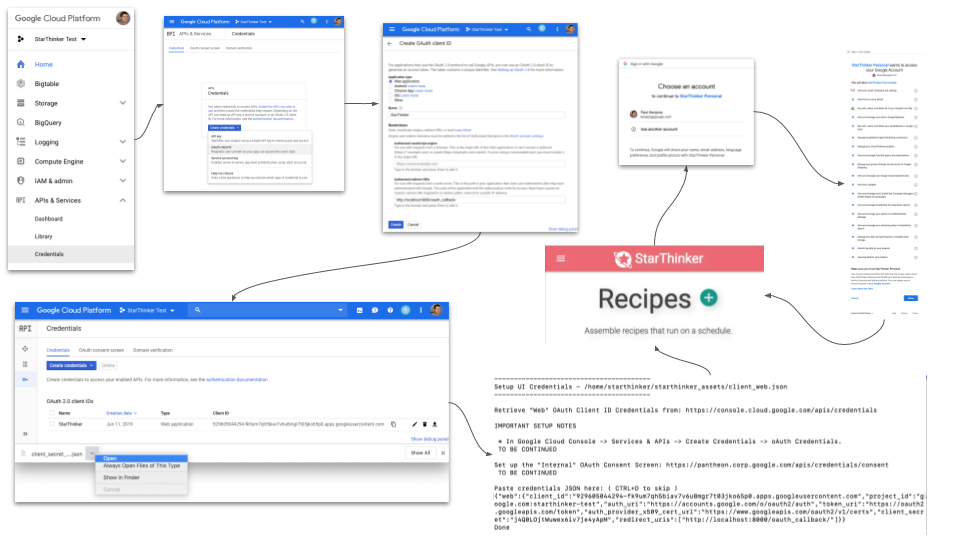

# StarThinker UI Client Credentials

## Create Client Credentials ( Web )

Retrieve oAuth Client Id from: https://console.cloud.google.com/apis/credentials


[View Cloud Client UI Setup Larger](images/cloud_client_web.png)

### Setup Steps

 1. Google Cloud Project -> APIs & Services -> Credentials -> Create Credentials -> oAuth Client Id.
   1. Select Web.
   1. Name is StarThinker.
   1. Auth Redirect URI is ( you can have several or change them later ):
     - http://localhost:8000/oauth_callback/ ( if you deploy the local UI )
     - http://[your appengine instance ]/oauth_callback/ ( if you deploy on appengine )
     - http://[your custom domain ]/oauth_callback/ ( if you deploy on a custom domain )
 1. Click the download icon next to the new credentials and open the downloaded file.
 1. Copy the contents and paste into the StarThinker deployment script when prompted for Client Web Credentials.

### Change Steps

If you change the Auth Redirect URI you will need to re-download the credentials into StarThinker.

 1. Edit the credentials and add a new Auth Redirect URI.
 1. Click the download icon next to the new credentials and open the downloaded file.
 1. Copy the contents and paste into the StarThinker deployment script when prompted for Client Web Credentials.
   1. ```source install/deploy.sh```
   1. ```7) Change UI Credentials```

### Verify

If all goes well, after deployment, the following file should exist with your credentials inside:

- starthinker_assets/client_web.json

---
&copy; 2019 Google Inc. - Apache License, Version 2.0
