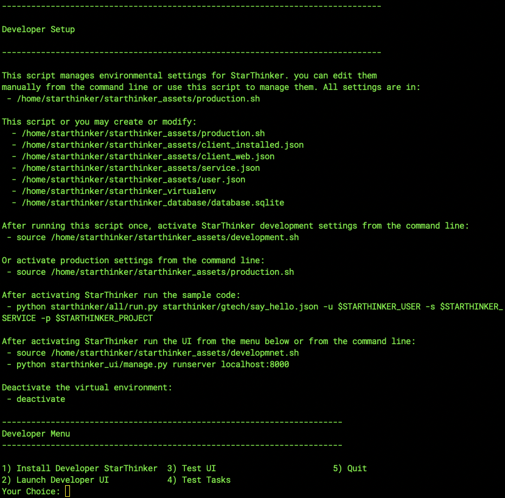

# Deploying For Development

For a quick start that will do nothing other than show how to sucesfully run a recipe:

First configure StarThinker by running...

```
git clone https://github.com/google/starthinker
```

```
cd starthinker
```

```
source install/deploy.sh 
```


*Option 1) Developer Menu*



*Option 1) Install StarThinker*

Then activate StarThinker virtualenv...

```
source starthinker_assets/development.sh
```

Finally run the sample aplication...

```
python starthinker/all/run.py starthinker/gtech/say_hello.json --verbose
```

[](https://console.cloud.google.com/cloudshell/editor?cloudshell_git_repo=https%3A%2F%2Fgithub.com%2Fgoogle%2Fstarthinker&cloudshell_tutorial=README.md)

Read more at [all/README.md](all/README.md) under Useful Developer Features. 


## How Do I Turn A Recipe Template Into A Recipe?

To quickly use any one of the template to perform a task, moving a DCM report for example:

```
python starthinker/script/run.py starthinker/gtech/script_dcm_to_bigquery.json -h
python starthinker/script/run.py starthinker/gtech/script_dcm_to_bigquery.json 7880 1234567 "" "Test_Dataset" "Test_Table" > test_recipe.json
python starthinker/all/run.py test_recipe.json
```

[](https://console.cloud.google.com/cloudshell/editor?cloudshell_git_repo=https%3A%2F%2Fgithub.com%2Fgoogle%2Fstarthinker&cloudshell_tutorial=README.md)

Read more at [script/README.md](script/README.md).

---
&copy; 2019 Google Inc. - Apache License, Version 2.0
