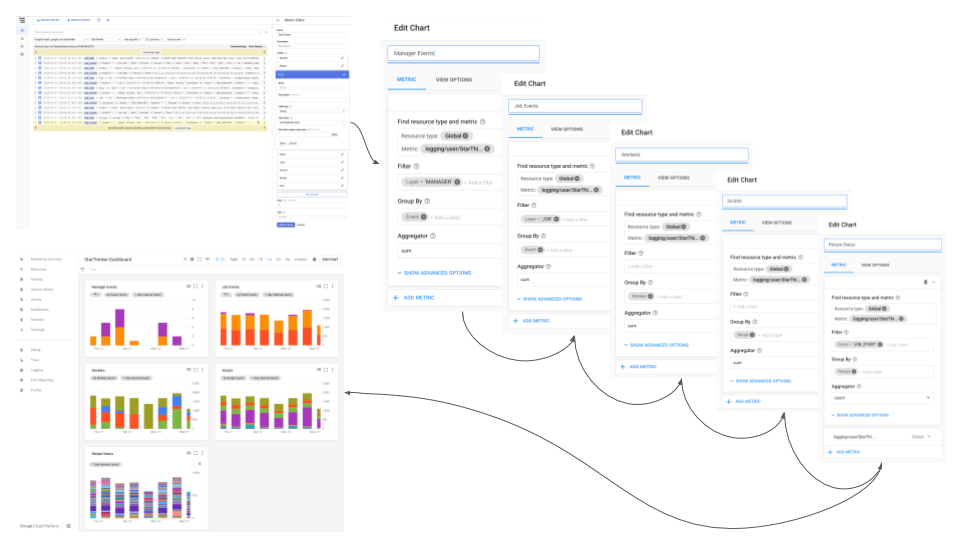
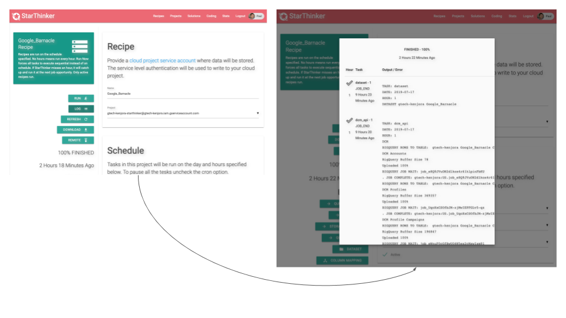

# Logging

All UI tasks log to StackDriver. All command line exections log to STDERR and STDOUT. Stackdriver
can be used to create dashboards and monitor the status of all StarThinker jobs.

## StackDriver Logs

[View StackDriver Logs Larger](images/logging_logs.png)

StarThinker logs embed parts of the script in the jsonPayload filed of StackDriver logs. This allows
logs to be filtered by values within each script.  Logging is used primarily by the job runner.

1. Logging structure is defined in: [starthinker_ui/ui/log.py](../starthinker_ui/ui/log.py).
1. Most logging occurs in: [starthinker_ui/recipe/management/commands/job_worker.py](../starthinker_ui/recipe/management/commands/job_worker.py)
1. View logs by visitng: https://console.cloud.google.com/logs/viewer
  - Change 'All Logs' to 'StarThinker'
  - Suggested log view adjustments:
    - Add field to summary line: labels.event
    - Add field to summary line: jsonPayload.recipe.setup.uuid
    - Add field to summary line: jsonPayload.recipe.setup.script
1. Tips for debugging scripts:
  - Filter by a specific jsonPayload.recipe.setup.uuid to view a single recipe timeline.
  - Remember to us Jomp to now button to move log window to current time.

## StackDriver Dashboard

Adding metrics and creating a dashboard in StackDriver helps monitor the system and find
optimization points.

[View StackDriver Dashboard Larger](images/logging_dashboard.png)

1. First create metrics from the [StackDriver Logs Viewer](https://console.cloud.google.com/logs/viewer) screen.
  - Name: StarThinker
  - Labels:
    - Severity:
      - Label Type: String
      - Field Name: Severity
    - Recipe:
      - Label Type: String
      - Field Name: jsonPayload.recipe.setup.uuid
    - Script:
      - Label Type: String
      - Field Name: jsonPayload.script
    - Event:
      - Label Type: String
      - Field Name: labels.event
    - Layer:
      - Label Type: String
      - Field Name: labels.layer
    - Version:
      - Label Type: String
      - Field Name: labels.version
    - Worker:
      - Label Type: String
      - Field Name: jsonPayload.job.worker
    - Hour:
      - Label Type: String
      - Field Name: jsonPayload.hour
  - Units: 1
  - Type: Counter

1. Second create a dashboard with charts from the [StackDriver Dashboards](https://app.google.stackdriver.com/dashboards)  screen.
  - For each chart select StackedBar.
  - Manager Events - shows critical manager errors, these should be close to zero, may indicate need for larger database.
    - Resource type: Global
    - Metric: logging/user/StarThinker
    - Filter: Layer="MANAGER"
    - Group By: Event
    - Aggregator: sum
  - Job Events - job start and end should be equivalent, job errors should be debugged and reduced to zero.
    - Resource type: Global
    - Metric: logging/user/StarThinker
    - Filter: Layer="JOB"
    - Group By: Event
    - Aggregator: sum
  - Workers  - all workers should have roughly equal share of jobs, may indicate frozen worker needing reboot.
    - Resource type: Global
    - Metric: logging/user/StarThinker
    - Group By: Worker
    - Aggregator: sum
  - Scripts - indicates which kinds of jobs are being run the most, for planning engineering resources.
    - Resource type: Global
    - Metric: logging/user/StarThinker
    - Group By: Script
    - Aggregator: sum
  - Recipes - shows recipe execution per day and hour, for visual analysis of a recipe.
    - Resource type: Global
    - Metric: logging/user/StarThinker
    - Filter: Event="JOB_START"
    - Group By: Recipe
    - Aggregator: sum

Next, learn how to [create a recipe](recipe.md) or look at the [cheat sheet of commands](cheat_sheet.md).

## Recipe Status In UI

Each recipe also has a curated custom status visible in the UI that is independent on the StackDriver logs.

[View UI Logs Larger](images/logging_ui.png)

## Cloud Resources

  - [Google Cloud StackDriver Dashboards](https://console.cloud.google.com/dashboards) - where visualization of metrics will be displayed.
  - [Google Cloud StackDriver Logs](https://console.cloud.google.com/logs/viewer) - where your logs will be written ( select StarThinker under All Logs ).
  - [Google Cloud Credentials](https://console.cloud.google.com/apis/credentials) - where you manage your credentials.
  - [Google Cloud Billing](https://console.cloud.google.com/billing/linkedaccount) - examine costs in real time.

---
&copy; 2019 Google Inc. - Apache License, Version 2.0
