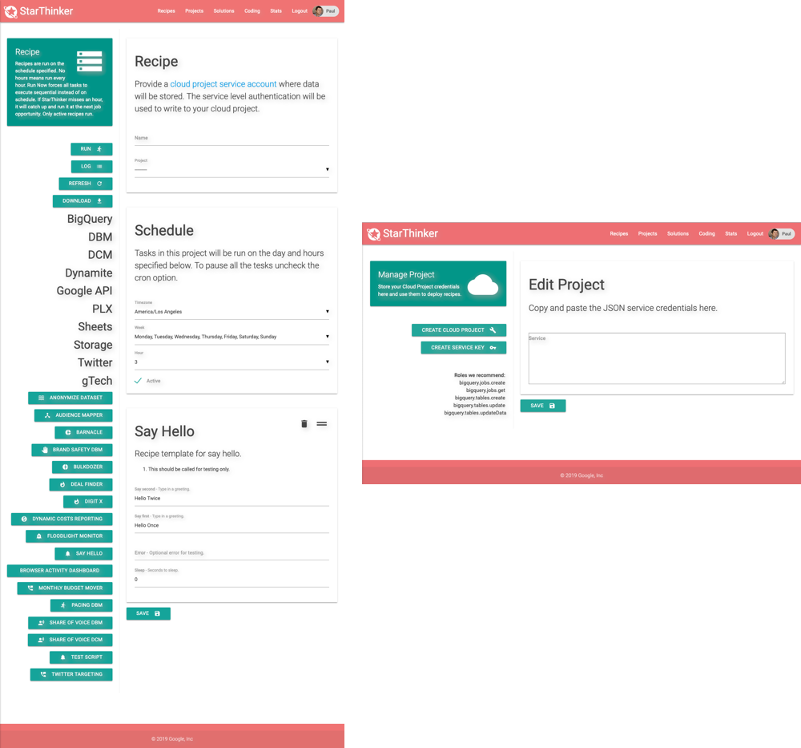

# StarThinker Launch Recipe / Solution From UI
  
## Launch a Recipe From The UI

After logging into the UI, either development or deployed on AppEngine...

[UI Recipe Create](images/ui_recipe_create.png)

### Notes

 - [Workers must be deployed](deploy_enterprise.md) for job to execute after setting up UI.
 - If jobs time out, the size and number of workers must be increased.
 - If IAP is enabled, users accessing the UI must be specified in the IAP configuration.
 - Every account and recipe is tied to a user, they cannot be shared.
 - Most recipes will require a Google Cloud Service Account.
 - StarThinker UI will ask you to log in again if you close the browser window, for security.

###  Steps

 1. Log into the StarThinker UI.
 1. Visit the Project page and click + next to Project.
   1. Follow these steps to [get a Service Account Credential](cloud_service.md).
   1. Click SAVE.
 1. Visit the Recipe page and click + next to recipe.
   1. Set Name to be the name of your recipe.
   1. Set Project to be the Service Account Credentials uploaded in steps above.
   1. Choose the schedule to run the recipe on.
   1. Ensure active is checked, otherwise recipe will not be executed.
   1. Click a task on the left to add it to the recipe workflow. 
     1. Re-arrange tack sequence by clicking = once then again on a = in another task.
     1. Clicking delete icon will remove task once you click save.
   1. Follow instructions on added task.
   1. Click SAVE and the recipe will execute on the schedule set.  If set for an hour earlier in the day, it will execute immediately.
   1. Click RUN to execute all parts of your recipe immediately regardless of schedule.
   1. Click LOG to see execution history and any errors for each task in your recipe.
  

### Fields

 - *Name* - name of recipe sometimes used by tasks to name artifacts.
 - *Project* - service credentials uploaded to the UI under the project tab.
 - *Timezone* - used by tasks and defines 24 hour reference point for recipe execution.
 - *Week* - dasy of the week to run the recipe on.
 - *Hour* - hour of the day to run the recipe on.

### Buttons

- RUN
  * Will cause all tasks in the recipe to be executed in sequence immediately. 
  * Only available if recipe is active.
  * Recipe recumes schedule in next 24 hour period.

- CANCEL
  * Stop the current and all future tasks from executing.

- LOG
  * Shows log of recipe tesks.
  * Find errors or additional instructions from specific tasks here.
  
- REFRESH
  * Refreshes the page loading new logs and status.

- DOWNLOAD
  * Download a JSON version of this recipe for debug purposes or sharing with clients.
  * Credentials are not stored int he recipe.
  * The recipe can be executed from the command line.

- REMOTE
  * Instructions for how to trigger this recipe remotely.
  
- TASK MOVE ( equals sign )
  * Click once to select, then again in another recipe to move the task above the 2nd click.

- TASK DELETE ( garbage can )
  * Click to place an X in the icon and mark for deletion.
  * Saving the recipe will remove all task marked for deletion.

- SAVE
  * At bottom of recipe.
  * Save the recipe changes.

- DELETE
  * At bottom of recipe.
  * Delete the recipe ( cannot be undone ).

---
&copy; 2019 Google Inc. - Apache License, Version 2.0
